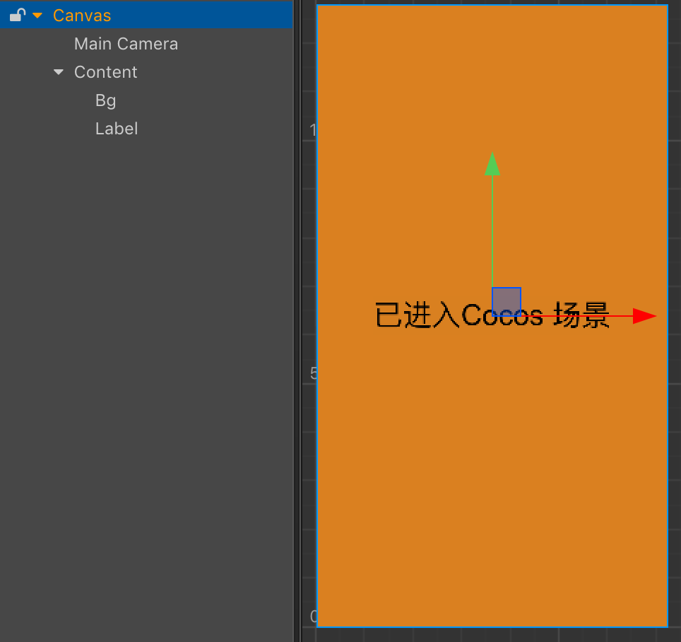
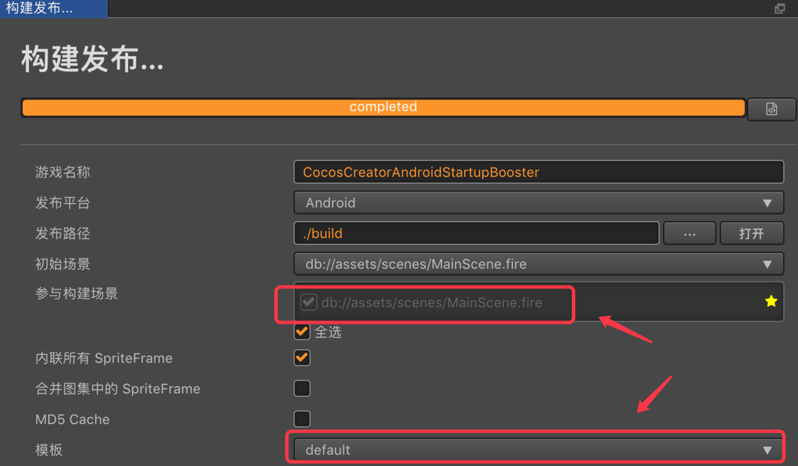
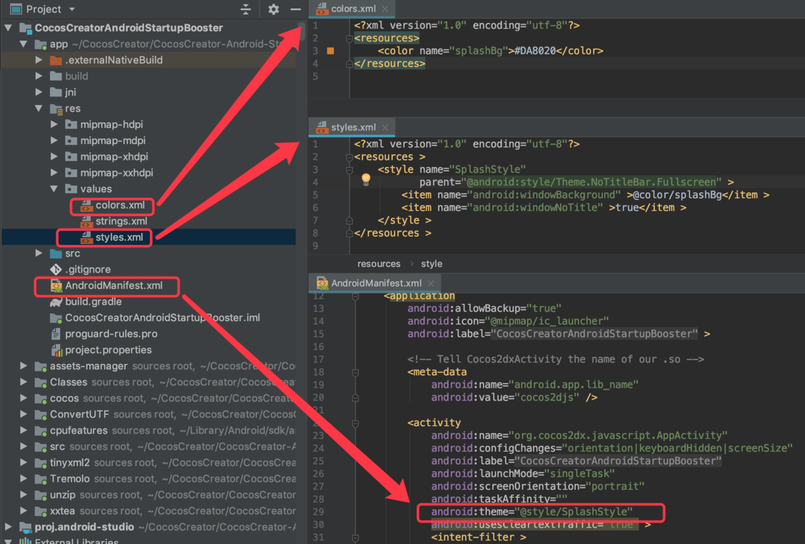
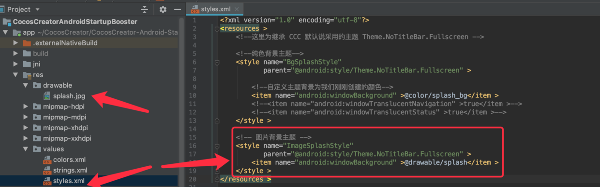
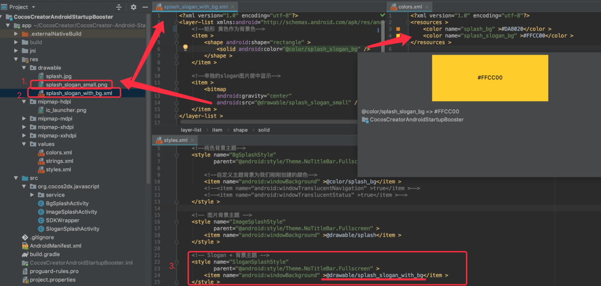

# Cocos Creator Android 原生启动优化系列 2 —— 自定义启动页

## 1. 前情回顾

在上一篇文章 Cocos Creator Android 原生启动优化系列 1 —— 黑屏原因分析 中，我们大概分析了一下 Android 黑屏的原因，共有3个阶段，主要在前两个原生阶段


第三阶段黑屏时长，实际上会和游戏首场景复杂度挂钩。越简单的首场景加载越快。本篇我们着重解决Android原生前两个阶段的黑屏问题。因此为了减少可变因子，我们直接以一个简单场景作为第三阶段要加载场景。



然后构建一个 Android 工程出来，这里特别需要注意一点：因为我们是探索测试，所以强烈建议采用基于 **`default`** 模板去进行操作（default 和 link 的区别可以查看[官方文档](http://docs.cocos.com/creator/manual/zh/publish/publish-native.html#%E9%80%89%E6%8B%A9%E6%BA%90%E7%A0%81)）



OK，准备好了，Let's go!


# 2. 基于 Android Theme 做体验优化

一种简单的解决方案就是直接设置 AppActivity 的 [主题Theme（官方文档介绍，需翻墙）](https://developer.android.com/guide/topics/ui/themes.html?hl=zh-cn)，以下为摘自文档的两段说明，方便大家简单理解。

> **样式**是指为 [View](https://developer.android.com/reference/android/view/View.html?hl=zh-cn) 或窗口指定外观和格式的属性集合。样式可以指定高度、填充、字体颜色、字号、背景色等许多属性。 样式是在与指定布局的 XML 不同的 XML 资源中进行定义。
>
> **主题**是指对整个 [Activity](https://developer.android.com/reference/android/app/Activity.html?hl=zh-cn) 或应用而不是对单个 [View](https://developer.android.com/reference/android/view/View.html?hl=zh-cn)（如上例所示）应用的样式。 以主题形式应用样式时，Activity 或应用中的每个视图都将应用其支持的每个样式属性。 例如，您可以 Activity 主题形式应用同一 `CodeFont` 样式，之后该 Activity 内的所有文本都将具有绿色固定宽度字体。

OK，那么现在我们试试将我们的 AppActivity 主题修改一下。

比如：设置游戏开屏颜色为其他颜色，又或者将一张游戏图片作为游戏开屏背景

## 2.1 设置其他颜色作为开屏背景

1. 创建一个自定义颜色（`app/res/values/colors.xml`）

```
<?xml version="1.0" encoding="utf-8"?>
<resources>
    <!-- 这里我们取主场景的背景色 -->
    <color name="splashBg">#DA8020</color>
</resources>
```

2. 创建一个主题 （`app/res/values/colors.xml`)

```
<?xml version="1.0" encoding="utf-8"?>
<resources >
	<!--这里为继承 CCC 默认说采用的主题 Theme.NoTitleBar.Fullscreen -->
	<style name="SplashStyle"
	       parent="@android:style/Theme.NoTitleBar.Fullscreen" >
		
		<!--自定义主题背景为我们刚刚创建的颜色-->
		<item name="android:windowBackground" >@color/splashBg</item >
		
		<!--令主题无标题-->
		<item name="android:windowNoTitle" >true</item >
	</style >
</resources >
```

3. 修改主 Activity 的主题为我们刚刚创建的主题（`app/AndroidManifest.xml`）

```
<activity
	android:name="org.cocos2dx.javascript.AppActivity"
	...  
	android:theme="@style/SplashStyle"
  	...
	>
	...
</activity >
```

整体修改大概如下：



现在我们跑一下


嗯？一开始看起来比黑屏好多了，但是之后又黑屏了，然后才进入到我们的主场景，那么这是为什么呢？这里面发生了什么呢？这里我们需要再次看回黑屏的三个阶段


从上面这个图，我们不难得到答案。

1. 首先我们设置的主题在第一个阶段生效了，所以一打开游戏就是我们期望的背景颜色
2. 然后一段时间之后，进入到第二个阶段，触发了 `setContentView` ，因此 AppActivity 拥有了 ContentView 了，从而会挡住主题，而又因为之前我们分析过，这里的 setContentView 是没有背景的，所以就出现黑屏了
3. 然后黑屏一直持续到我们的主场景加载成功，最后出现我们的主场景

OK，所有现象，完美符合代码运行（多看源码）。

那么这里的黑屏我们又该怎么解决呢？

在不大改源码的情况下，我们可以这样子来：

1. 在第二个阶段再次添加新的 **纯色背景ImageView** 放到最上层，那么第二个阶段也就是我们期望的颜色了
2. 然后在第三阶段结束，也就是我们主场景加载后，我们在通过 JSB 通知原生 Activity 该隐藏这个 **纯色背景ImageView** 了

Android 原生代码如下：

```
public class AppActivity extends Cocos2dxActivity {
	
	private static Cocos2dxActivity sCocos2dxActivity;
	
	private static ImageView sSplashBgImageView = null;
	
	private static void showSplash() {
		sSplashBgImageView = new ImageView(sCocos2dxActivity);
		sSplashBgImageView.setBackgroundColor(
			sCocos2dxActivity.getResources().getColor(R.color.splashBg)
		);
		sSplashBgImageView.setScaleType(ImageView.ScaleType.FIT_XY);
		sCocos2dxActivity.addContentView(sSplashBgImageView,
				new WindowManager.LayoutParams(
						FrameLayout.LayoutParams.MATCH_PARENT,
						FrameLayout.LayoutParams.MATCH_PARENT
				)
		);
	}
	
	/**
	 * 这是给 CC JS 调用的隐藏原生开屏背景的方法
	 */
	public static void hideSplash() {
		sCocos2dxActivity.runOnUiThread(new Runnable() {
			@Override
			public void run() {
				if (sSplashBgImageView != null) {
					sSplashBgImageView.setVisibility(View.GONE);
				}
			}
		});
	}
	
	@Override
	protected void onCreate(Bundle savedInstanceState) {
 		...
		// DO OTHER INITIALIZATION BELOW
		SDKWrapper.getInstance().init(this);

		// 第一步：在第二阶段加入我们的背景View
		sCocos2dxActivity = this;
		showSplash();
	}

	...
}
```

主场景挂一个脚本：

```
@ccclass
export default class MainSceneCtrl extends cc.Component {

	start() {
		// 第二步：场景加载之后，隐藏原生纯色背景View
		// 这里延迟1秒是为了更好的体验，实际可以不用
		this.scheduleOnce(() => {
			this._hideNativeSplash();
		}, 1);
	}

	private _hideNativeSplash() {
		if (CC_JSB) {
			if (cc.sys.os == cc.sys.OS_ANDROID) {
 				// 反射调用原生的隐藏方法
				jsb.reflection.callStaticMethod(
					"org/cocos2dx/javascript/AppActivity",
					"hideSplash",
					"()V"
				);
			}
		}
	}
}
```


那么，再跑一下？


现在，我们成功地把黑屏给切换为一个有颜色的启动页了，原生和JS完美切换，看起来比黑屏好多了

## 2.2 设置图片作为开屏背景

当然，上一章，我们更多是一种验证和测试，而事实上，这个方法可行，并且 **我们实现了使用任意纯色背景作为启动页！**

但实际我们更有可能在启动页放的是一个带背景的游戏LOGO、游戏插图等图片，比如这样子：


那么这个又应该怎么实现呢？其实有了上一章基础之后，我们只需要极小的改动就可以实现了

1. 首先我们简单修改下游戏场景，恩，其实就是一个图片背景加点Label
2. 然后，第一阶段黑屏处理：
  2.1 将启动页图片加入到Android工程的 drawable 中
  2.2 然后修改我们刚刚的主题（或者新建一个主题）背景为启动页图片
  2.3 设置 `app/AndroidManifest.xml` 中的 Activity 主题为第2步的主题

3. 最后，第二阶段黑屏处理：
  3.1 基于上一章代码，修改ImageView的背景颜色为背景图片即可
  ```
  -- sSplashBgImageView.setBackgroundColor(
  --     sCocos2dxActivity.getResources().getColor(R.color.splash_bg)
  -- );

  ++ sSplashBgImageView.setImageResource(R.drawable.splash);
  ```

OK，恭喜你又收获一个技能。

当然，这里还有其他一些问题需要关注的。比如：

我们一直在设置的主题背景，如果是纯色背景，那么很容易理解它的填充方式，就是全屏填充。但是，如果背景换成了图片，那么图片是怎么填充到屏幕的呢？拉伸？缩放？九宫格？保持尺寸不变？

要知道，我们上述步骤，本质上，给第一阶段黑屏设置一个（主题）背景，给第二阶段设置一个背景，而如果这两个阶段的背景都是图片（*第三阶段就是场景了，不同游戏不一致，这里我们不讨论*），那么我们假设一种情况如下：

* 第一个阶段是 *拉伸图片* 以达到全屏
* 第二个阶段是 *缩放图片* 以达到全屏

那么显然在部分分辨率上是达不到上面我们图示那样子的无缝原生与JS切换的UI体验的。那么图示为什么又那么完美呢？其实只是因为启动页图宽高比和手机分辨率宽高比恰好一致，要是不一致就会很难看

所以，理解不同阶段的图片填充方式，对于这个启动过程无缝切换很重要。

可以确定的是，第二阶段，其实我们可以随便控制填充方式，比如：例子代码中我们用的是 `FIT_XY` ，当然还有其他很多 [ImageView.ScaleType](https://developer.android.com/reference/android/widget/ImageView.ScaleType)。但遗憾的是，我们第一阶段的 `windowBackground` 是采用拉伸图片的方式去适配的，那么只用一张固定尺寸的图片，那么肯定会出现在部分手机上有拉伸的问题。

此时，这种设置单一全屏图片的方式已经存在缺陷了，所以这也有可能是大部分游戏开屏没有全屏图片启动页的一个成因

## 2.3 设置 Slogan + 背景色 作为启动页

那么大部分游戏的启动页长什么样子呢？一般都是一个 Slogan + 背景色 作为启动页，比如这样子：


同样在上面章节的基础上，我们只需要改动几个地方就可以实现了

第一阶段黑屏处理：
 
1. 将你的 Slogan 图片加入到Android工程的 drawable 中（假设文件名字为 `splash_slogan_small.png`)，同时建立一个背景色
```
<?xml version="1.0" encoding="utf-8"?>
<resources >
	...
	<color name="splash_slogan_bg" >#FFCC00</color >
</resources >
```
2. 创建一个DrawableXML文件（如：`app/res/drawable/splash_slogan_with_bg.xml` )，然后使用 [Android 的图层列表 LayerList【需翻墙】](https://developer.android.google.cn/guide/topics/resources/drawable-resource?hl=zh-cn#LayerList) 生成一个 Drawable，这个 Drawable 由一个纯色的矩形作为背景色，以及在这之上放置一个 Slogan 的 Bitmap 图片
```
<?xml version="1.0" encoding="utf-8"?>
<layer-list xmlns:android="http://schemas.android.com/apk/res/android" >
	<!--矩形 黄色作为背景色-->
	<item >
		<shape android:shape="rectangle" >
			<solid android:color="@color/splash_slogan_bg" />
		</shape >
	</item >
	
	<!--单独的slogan图片居中显示-->
	<item >
		<bitmap
			android:gravity="center"
			android:src="@drawable/splash_slogan_small" />
	</item >
</layer-list >
```
3. 修改我们刚刚的主题（或者新建一个主题）背景为刚刚的图层列表文件
4. 设置 `app/AndroidManifest.xml` 中的 Activity 主题为第3步的主题

第一阶段操作结果预览：



第二阶段黑屏处理：

1. 基于上一章代码，修改ImageView的背景图片为我们刚刚创建的Drawable
```
-- sSplashBgImageView.setImageResource(R.drawable.splash);

++ sSplashBgImageView.setImageResource(R.drawable.splash_slogan_with_bg);
```

OK，大功告成。

现在我们来盘点一下，比如：

为什么我们要用  [Android 的图层列表 LayerList【需翻墙】](https://developer.android.google.cn/guide/topics/resources/drawable-resource?hl=zh-cn#LayerList) ？

这是因为比起上一章单纯的图片可能存在在部分机器上出现拉伸的问题，使用 LayerList 能更好适配，同时比起单纯一张图片，LayerList也更加做多层级组合（背景+Slogan+...）的启动页。

如果你想在此基础上实现贴底部的 Slogan 其实也是可以的，但是篇幅问题，我这里就不在详述，可以详细阅读  [Android 的图层列表 LayerList【需翻墙】](https://developer.android.google.cn/guide/topics/resources/drawable-resource?hl=zh-cn#LayerList) 。

## 3. 总结

当然，这个系列没完，这篇只是在不改源码的基础上提升UI体验，实际并没有给减少启动时间，下一篇我们会尝试修改底层源码以减少启动时长。

## 4. 题外话

写这个系列的文章的时候，我可能更多地倾向于 **`fishing`** 。

### **Not only the fish, but fishing！**

我不知道我是否还能坚持写这类型文章。因为每一篇都需要开项目验证，进行大量录屏，截图，组织思路，写过程，画图，摘录官方文献等等，一套操作下来，十分耗时，就像这个系列，我断断续续写了两个多月。当然，这也有可能是因为我懒 ╮(￣▽￣)╭ 。

所以，如果我的文章帮助到你，不妨给我个👉👉 赞赏 👈👈激励下我吧~


# 5. 参考资料

* [https://forum.cocos.com/t/topic/52465](https://forum.cocos.com/t/topic/52465)
* [https://forum.cocos.com/t/cocos-ios/56599](https://forum.cocos.com/t/cocos-ios/56599)
* [https://forum.cocos.com/t/loadscene/51364](https://forum.cocos.com/t/loadscene/51364)
* [Android 中样式 Style 与主题 Theme 的介绍【官网】【需翻墙】](https://developer.android.com/guide/topics/ui/themes.html?hl=zh-cn)
* [Android LayerList【官网】【需翻墙】](https://developer.android.google.cn/guide/topics/resources/drawable-resource?hl=zh-cn#LayerList)
* [Splash适配解决启动图拉伸的问题](https://blog.csdn.net/aa464971/article/details/86692198)
* [Android启动页优化，去黑屏实现秒启动](https://www.jianshu.com/p/662274d5d637)
* [Android性能优化之启动优化](https://juejin.im/post/5ce8daa95188250ae716e1c2)
* [Android 性能优化—— 启动优化提升60%](https://mp.weixin.qq.com/s/OWImTj_4Ml1nmpN2v9mRAw)
