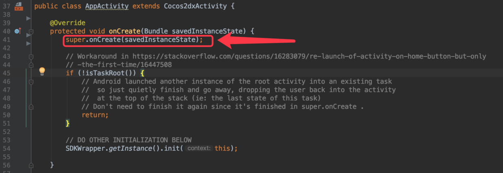
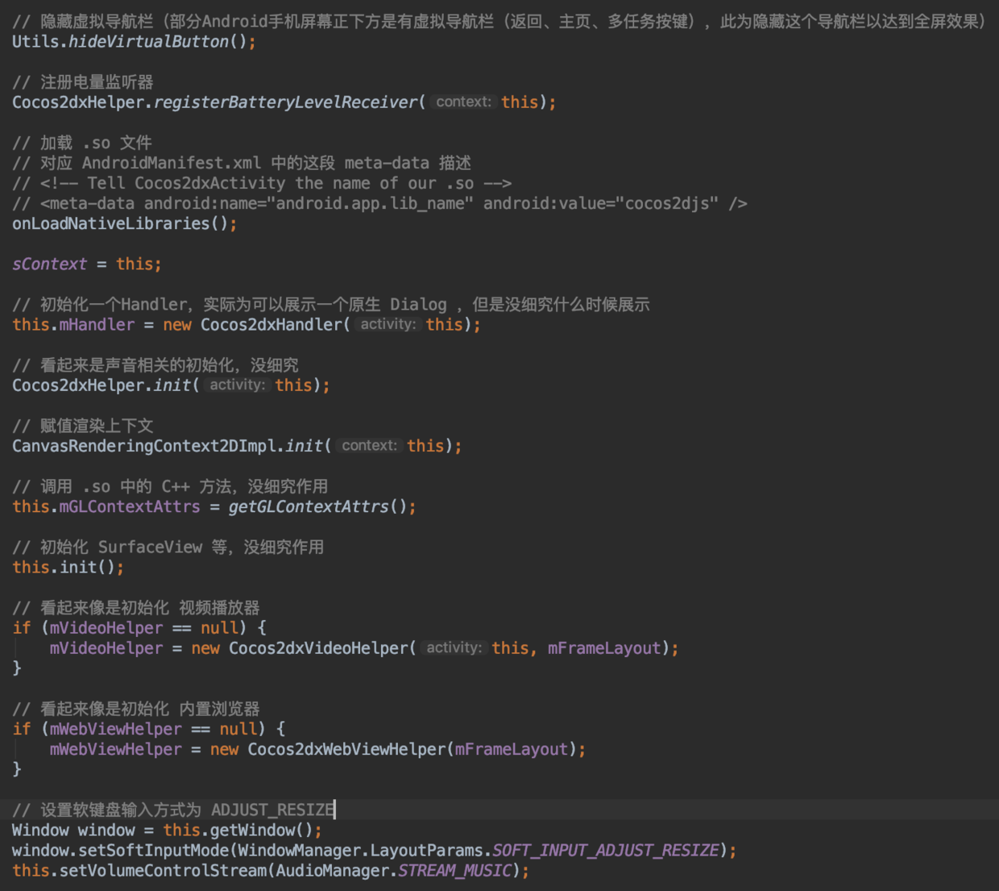
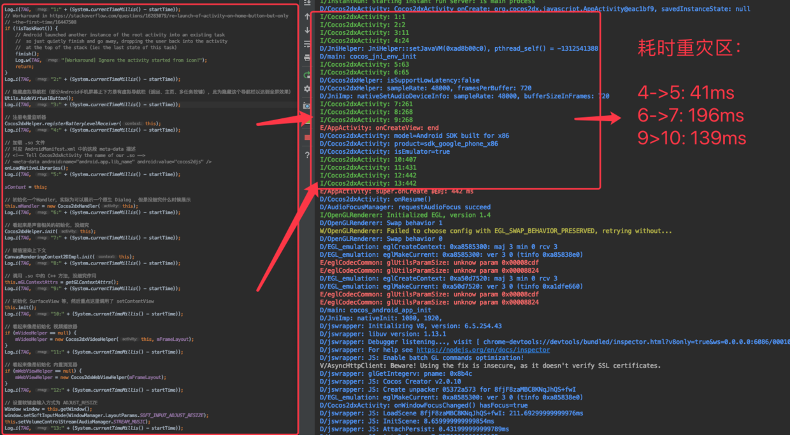
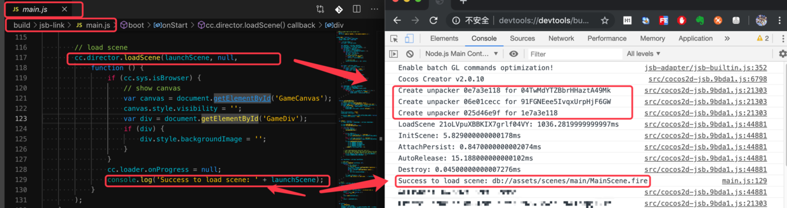
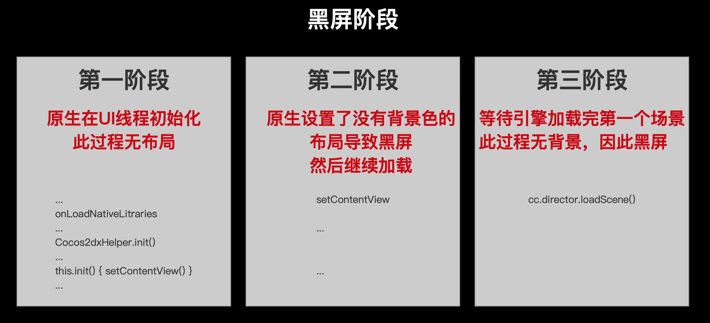

# Cocos Creator Android 原生启动优化系列 1 —— 黑屏原因分析

## 1. 重要

1. 本文主要针对 Cocos Creator **`v2.0.10`** 版本进行分析和处理，没有在 Cocos Creator  **`v1.x`**、**`v2.1.x`** 上进行验证分析，不确定是否通用

## 2. 前言

Cocos Creator 的打包出来的原生项目（即便是一个空白项目），都会出现打开应用后， **「黑屏」** 一段时间然后才能进入到场景的问题，视乎机型与Android系统版本，这个 **「黑屏」** 时长可能会持续不同时间，但是实际测试这个持续最短可能也要1~2秒，嗯，在我看来，这基本是完全不可用，因此我们需要优化改进

## 3. 「黑屏」原因

Cocos Creator 打包出来的 Android 项目，主 Activity 都是 AppActivity，无其他特殊修改外时，入口都是从 `AppActivity#onCreate` 方法中，但是因为 AppActivity 是继承 Cocos2dxActivity ，因此实际的主入口在 Cocos2dxActivity 的 onCreate 方法中，即对应下面的 `super.onCreate(savedInstanceState);`

而在阅读 `Cocos2dxActivity#onCreate` 方法实现之后，可以大致得出这个方法执行的逻辑：

从上图可知，整个 `Cocos2dxActivity#onCreate` 方法执行了很多初始化逻辑，那么究竟是哪里耗时比较严重呢？我们为每个关键行都打一下Log：

从上图可以看到，几个耗时重灾区

| 操作  | 执行代码                | 作用           | 耗时  |
| ----- | ----------------------- | -------------- | ----- |
| 4->5  | onLoadNativeLitraries() | 加载 so 文件   | 41ms  |
| 6->7  | Cocos2dxHelper.init()   |                | 196ms |
| 9->10 | this.init()             | setContentView | 139ms |

可以看到 `onCreate` 整个生命周期中，这几行代码占据了大量时间，而  onCreate 是执行在UI线程上，所以这里是卡死的。

Android 中 Activity 的布局一般是在 `setContentView` 方法之后才会显示，也就是才有内容显示出来，而 `setContentView` 的调用时机是在 9->10 也就是 `this.init()` 方法中才执行。而 `this.init()` 的执行时机，从上图看出，已经是很晚了。那么在 `setContentView` 之前的这段时间，也就意味着这个 Activity 是没有布局的，那么就会出现黑屏了，而这就是「黑屏」的原因之一，也是 **「黑屏」的第一阶段** 。

那么， `setContentView`（即执行了 `this.init()` 方法） 之后，是否就不会黑屏呢？

答案是：依旧还是会黑屏

在仔细阅读下面 `this.init()` 方法后

.png)

可以返现这里面的 `setContentView` 此时并没有设置任何有颜色的组件，因此还是会黑屏，而这就是 **「黑屏」的第二阶段** 

那么这之后是否就算是结束黑屏呢？然而还不是！

但其实到这里距离黑屏结束也快了，因为这之后就是加载我们的场景了，但是加载场景是需要一定时间的，比较典型的就是 `main.js` 中的加载场景代码

视乎我们场景的复杂度，越复杂的场景，加载越久，而这期间，还是黑屏，这就是  **「黑屏」的第三阶段**

总结下来，Cocos Creator Android 原生项目的启动流程大致如下：

至此，对于黑屏的理解，我们应该有一个 **大概** 的认识。更加重要的是，我们能得出一些结论：

所有JS/主场景的优化方案，在 **一定程度上** 都是属于弱优化，因为黑屏大头在前面两个阶段，JS/场景优化只能优化**第三阶段**的黑屏。这也是哪怕你建立一个空白项目打包也会出现黑屏的原因，问题不在于场景大小，js脚本复杂度，而在于 **原生启动阶段** 

至此，对于黑屏的成因我们已经有一定的了解，下一篇文章我们会针对性推出一些解决方案，敬请期待

***PS：作者很懒╮(￣▽￣)╭，记得激活下作者哦↑↑↑↑↑***

